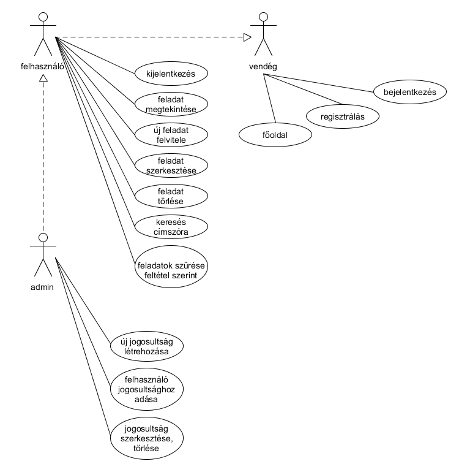
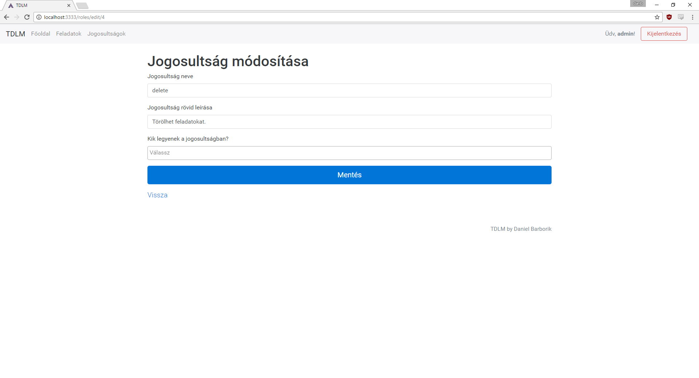

# To-Do List Manager / TDLM

A féléves projectem az ELTE-IK/Alkalmazások fejlesztése tantárgyhoz egy to-do lista kezelő, főleg kisebb cégek számára.

Készítette: Barborik Dániel / MOZ64X / danb at outlook dot hu

# Futtatás

1. clone
2. npm install
3. '.env.example' fájl átnevezése '.env'-re
4. npm run

5. az admin funkciók eléréséhez fiók: admin@admin.hu / admin

# 1. Követelményanalízis

__Célkitűzés:__

Kis létszámú cégünkben előforduló probléma, hogy a rengeteg teendő között egy-egy feladat elkallódik, megoldatlanul marad.

Van, hogy erre a rákövetkező meetingen fény derül, de olyan is előfordult már hogy csak hónapokkal később jöttünk rá, hogy elmaradásunk van.

Ennek a programnak a fő célja egy olyan felület létrehozása, ahol a céges teendőket átláthatóan lehet számontartani, illetve a teendőkhöz embereket, prioritást, és határidőt lehet rendelni.

__Funkcionális követelmények:__

- regisztráció
- bejelentkezés
- jogosultságok adása
- csak bejelentkezett és jogosultsággal bíró felhasználók által elérhető funkciók:
  - új feladat felvétele a listára
  - meglévő feladatok szerkesztése
  - meglévő feladat lezárása (ha sikeresen végrehajtotta azt)
  - meglévő feladat törlése
  - feladatok keresése (címszó szerint) és szűrése (pl. prioritás szerint)

__Nem funkcionális követelmények:__

- __könnyű áttekinthetőség:__ a listának jól átláthatónak kell lennie, csoportosítva, dátumozva, figyelemfelhívó színekkel
- __használhatóság:__ könnyen használhatónak kell lennie, ügyelni kell az adatfelviteli mezők ésszerű elhelyezésére, és fel kell tüntetni hogy pontosan mi mire való
- __megbízhatóság:__ jelszóval védett oldal létrehozása, a jelszavak titkosítása, az adatfelviteli mezők pontos ellenőrzése mielőtt azok az adatbázisba kerülnek
- __karbantarthatóság:__ könnyen lehessen bővíteni a projectet, clean code

__Fogalomjegyzék:__

- __teendő:__ egy feladat, ami egy (vagy több) emberhez van rendelve, van egy címe és egy egy rövid leírása (utóbbi nem kötelező), felvételi ideje, határideje, és prioritása

__Használati esetek:__

# 2. Tervezés

### Oldaltérkép

__publikus:__

- főoldal
- bejelentkezés
- regisztráció

__bejelentkezett:__

- feladatok
  - új feladat
  - feladat megtekintése
    - feladat szerkesztése
    - feladat törlése

- jogosultságok
  - új jogosultságok
  - jogosultság szerkesztése
  - jogosultság törlése

### Design-tervek végső megvalósítása

Főoldal

Regisztráció

Bejelentkezés

Feladatok

Új feladat

Feladat részletek

Feladat szerkesztés

Feladat törlés

Jogosultságok

Új jogosultság

Jogosultság szerkesztése

Jogosultság törlés

### Adatbázis-kapcsolatok

# 3. Implementáció

# 4. Tesztelés

# 5. Felhasználói dokumentáció